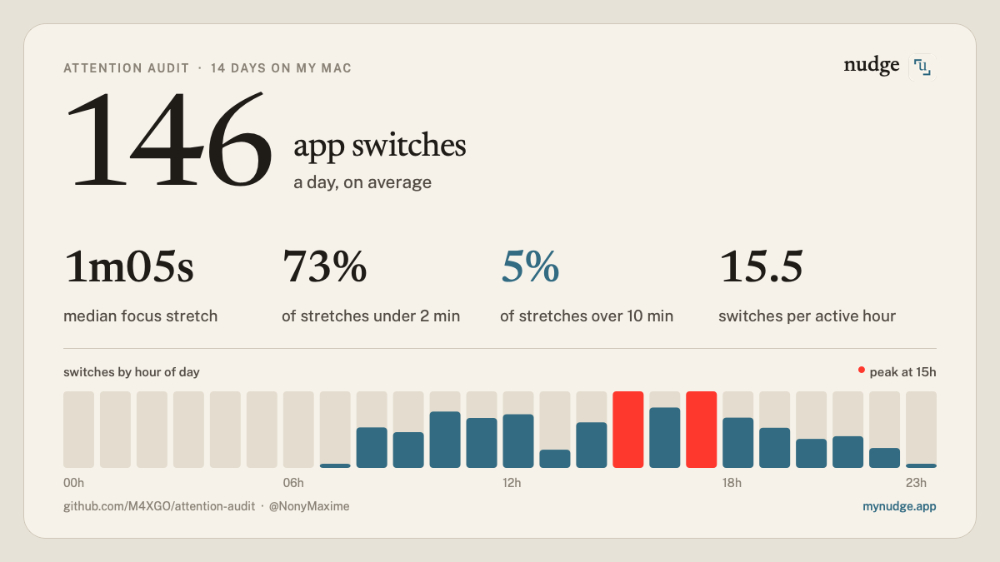

# attention audit

How many times a day do you actually switch apps on your Mac? Run this for a week and find out.



## Install

Open Terminal, paste this, press enter:

```bash
curl -fsSL https://raw.githubusercontent.com/M4XGO/attention-audit/main/install.sh | bash
```

That's it. No sudo, no permission prompt, nothing to configure.

- The audit runs quietly in the background and restarts at login.
- After 7 days, a prompt offers your card. One click: it opens, with a prefilled post if you want to share it.
- Want it earlier? Open **Attention Card** from Spotlight or `~/Applications`.

Uninstall any time:

```bash
~/.attention-audit/install.sh uninstall
```

## Privacy

Read the scripts before you run them, they are short on purpose.

- Only the **name of the frontmost app** is recorded (`Firefox`, `Slack`, ...). No window titles, no URLs, no keystrokes, no screenshots.
- It reads that name from LaunchServices (`lsappinfo`), which is why no Accessibility permission is needed.
- Everything stays in `~/.attention-audit/data` as plain CSV. There is no network call anywhere, except `install.sh` downloading these files from this repo.
- The card never shows app names, so you can post it as is.
- Nothing is ever posted for you: the share button only opens a draft.

## Files

| File | What it does |
|---|---|
| `audit.sh` | every 30s, logs the frontmost app to a daily CSV. 5 min without input counts as idle |
| `card.sh` | builds the card, opens it, opens a draft post |
| `card.js` | computes the numbers and draws the card with macOS AppKit (JavaScript for Automation) |
| `install.sh` | copies the files, starts `audit.sh` at login (LaunchAgent), creates Attention Card.app |

Prefer running it by hand? Clone the repo, run `./audit.sh` in a terminal tab, and `./card.sh` whenever you want your numbers (`./card.sh --no-share` to only print them).

## What the numbers mean

- **app switches a day**: how often the frontmost app changed while you were active.
- **focus stretch**: an uninterrupted run on a single app. The median tells you how long you typically stay before switching.
- **under 2 min / over 10 min**: share of stretches that were very short vs. long enough to get real work done.
- **switches by hour**: when your day gets most fragmented. The red bars are the peaks.

App-level is a rough proxy: switching from your editor to the docs for the same task counts as a switch. It's a mirror, not a verdict.

If you post your card, tag [@NonyMaxime](https://x.com/NonyMaxime): I repost the most interesting ones and I'm collecting them to see what "normal" looks like.

## Why this exists

I'm building [Nudge](https://mynudge.app/?utm_source=attention-audit&utm_medium=readme#waitlist), a Mac app that doesn't block you but brings you back to where you were after a switch. This audit is the throwaway version I used to measure the problem on myself first. It stays free and open source.

## License

MIT
